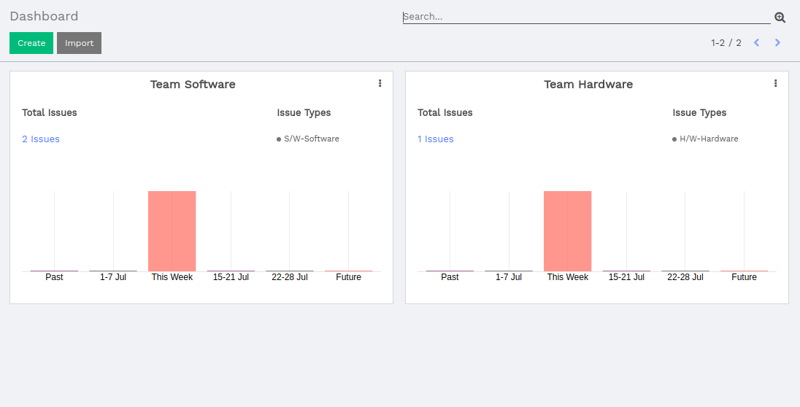
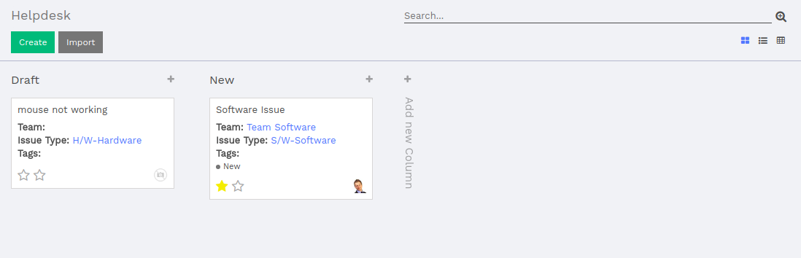
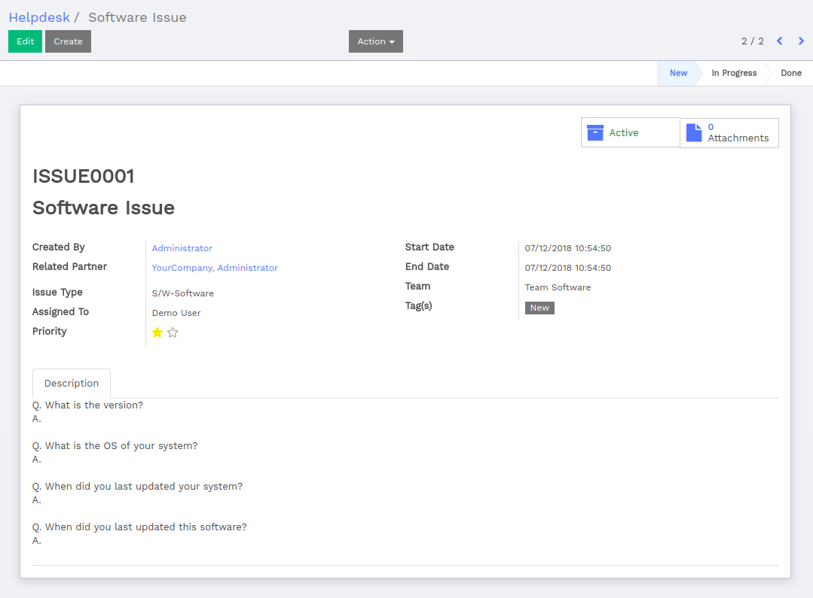
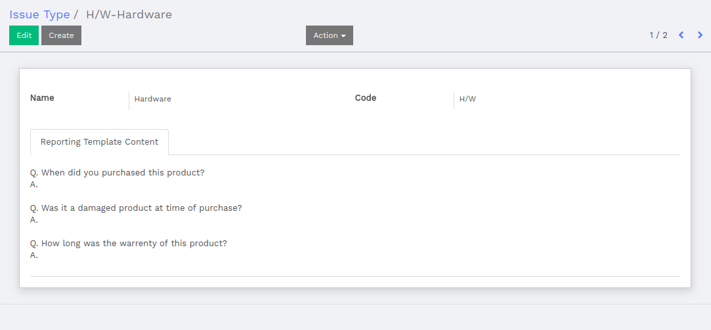
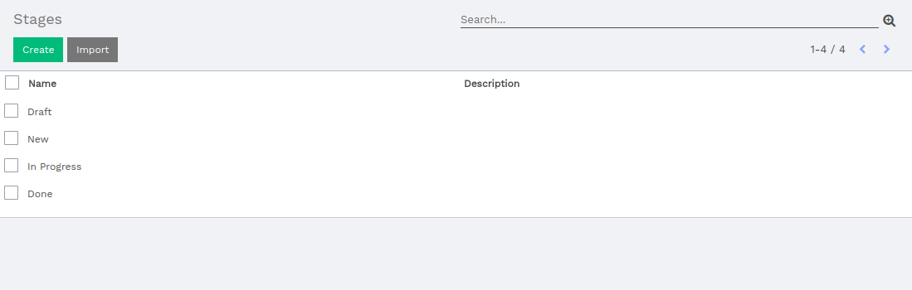
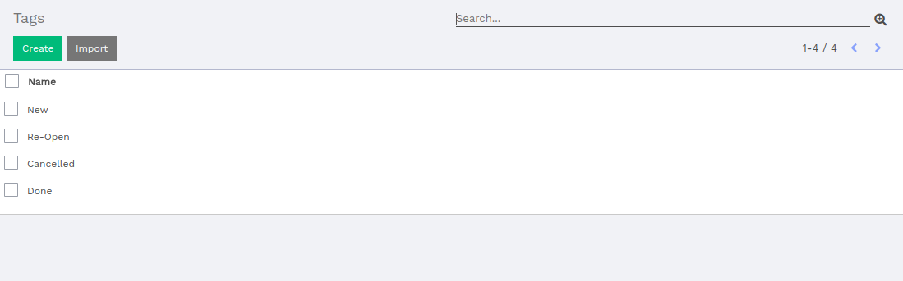
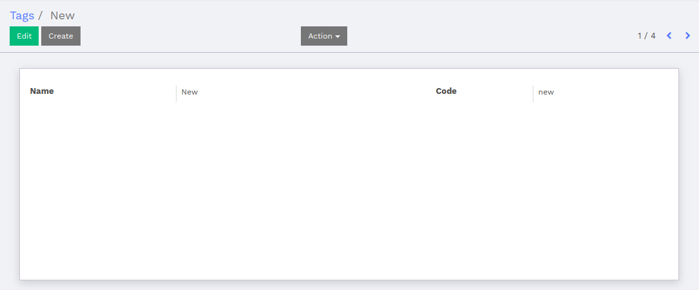
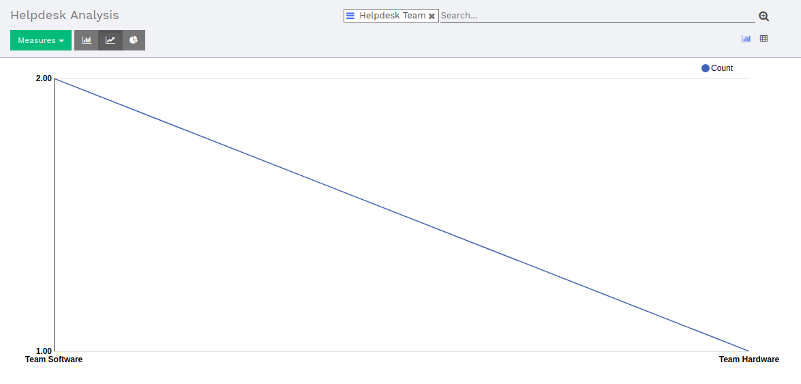
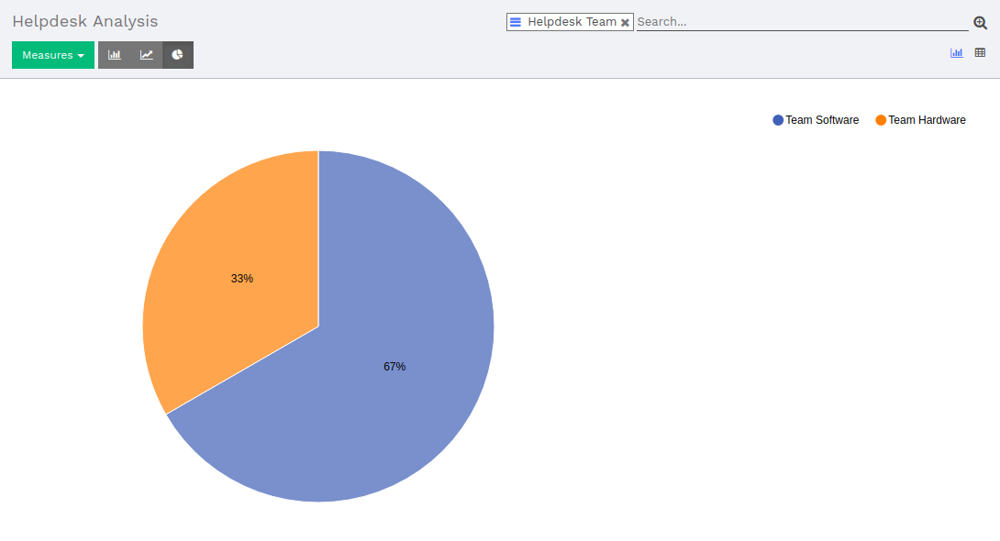
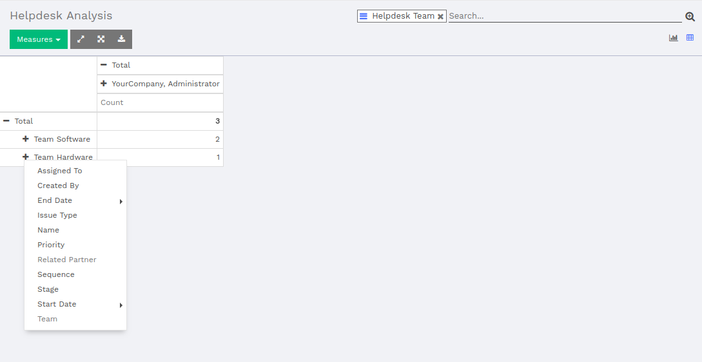

:banner: image/helpdesk.jpg

.. _setup/install:

========
Helpdesk
========

This document provides a brief information of what is helpdesk and its
workflow.

.. _helpdesk_dashboard:

Dashboard
---------

A helpdesk is a department inside an organization that is responsible for
answering the technical questions of its users.

A dashboard of helpdesk displays teamwise total counts of helpdesk, its issue
type and graphical view.

* Total Issues: Total number of issues.

* Issue Types: Type of an issue.

* Graphical view for the total number of issues.

.. _teamwise_ticket_view:

Tickets displayed in below image will be filtered by its team clicked from
dashboard.

.. image:: image/teamwise_ticket.png
   :class: img­responsive

Helpdesk
--------

There are different types of views for helpdesk ticket.

.. _helpdesk_kanban_view:

Kanban View
===========

The kanban view for helpdesk, shows the details like issue name, issue
type, team, tags and also its priority and user related details which will
be grouped by its state.

* Name: Title of the issue.

* Team: Team which will be responsible to solve the issue.

* Issue Type: Type of the issue.

* Tags: Tags for the issue.

* Priority: Priority of the issue.

* Assigned To: the user which is assigned a current issue to fix.

.. _helpdesk_form_view:

Form View
=========

The form view for helpdesk shows the details like issue sequence, issue
title, issue creator and its related partner details, issue type, team,
assigned to users, tags, its priority and its start and end date related
details.

Form view will take the following information to create an issue ticket:

* Sequence: Sequence of the issue which will be automatically generated.

* Issue Title: Title of the issue.

* Created By: The one who creates the current issue.

* Related Partner: Related partner details of created by the user which will be
  automatically fetched by the system.

* Start Date: Starting date of the issue.

* End Date: Ending date of the issue.

* Issue Type: Type of the current issue.

* Team: Team responsible to solve the current issue.

* Assigned To: User which is assigned to solve the current issue.

* Tags: Tags if any for the current issue.

* Priority: Priority for the issue to be fixed in specific time.

* Description: Detailed description of the issue.

On the top there are two buttons:

* Active: Make an issue Active/Archive.

* Attachments: It will redirect you to the attachments which are attached by
  users for issues. It will be helpful for the user to understand and fix
  exact issue.

Helpdesk Team
-------------

.. _helpdesk_team_kanban_view:

Kanban View
===========

A kanban view for helpdesk team which shows the total issues assigned to a
particular team and its issue type.

.. image:: image/helpdesk_team.png
  :class: img­responsive

* Total Issues: Total number of issues.

* Issue Types: Type of an issue.

.. _helpdesk_team_form_view:

Form View
=========

The helpdesk team's form view takes the following information to create a team:

* Helpdesk Team: Name of the team.

* Stages: Stages of the issue tickets.

* Issue Type: Multiple types of issues that will be solved by the current team.

* Email Alias: Mail Alias for the team.

* Team Members: Select members for the team.

.. image:: image/helpdesk_team_form.png
  :class: img­responsive

Issue Type
----------

.. _issue_type_kanban_view:

Kanban View
===========

From the helpdesk issue types kanban view one can create an issue by directly
clicking on ``Create`` button displayed on kanban view. There are the list
of stages and its related count for the issues present in that state. Also,
there is a graphical representation of the issue count based on its type of
issue.

.. image:: image/issue_type_kanban.png
  :class: img­responsive

.. _issue_type_form_view:

Form View
=========

The view of issue type form takes the following information to create an issue
type:

* Name: Name of the issue type.

* Code: Unique code for the issue type.

* Reporting Template Content: Content details / Basic Information to get from
  the user at the time of registering an issue.

Helpdesk Stages
---------------

.. _helpdesk_stage_tree_view:

Tree View
=========

Tree view for helpdesk stages.

.. _helpdesk_stage_form_view:

Form View
=========

The form view of helpdesk stages takes the following information to create a
new stage:

* Name: Name of the stage.

* Description: Description of the stage if any.

.. image:: image/stages_form.png
  :class: img­responsive

Helpdesk Tags
-------------

.. _helpdesk_tag_tree_view:

Tree View
=========

Tree view for helpdesk tags.

.. _helpdesk_tag_form_view:

Form View
=========

The form view of helpdesk tags takes the following information to create a
new tag:

* Name: Name of the tag.

* Code: Unique code for the tag.

Helpdesk Report
---------------

.. _helpdesk_bar_graph_report:

Bar Graph Representation
========================

Bar graph representation of helpdesk issues based on a team in which issue
tickets are assigned.

.. image:: image/helpdesk_report_bar_graph.png
  :class: img­responsive

.. _helpdesk_line_graph_report:

Line Graph Representation
=========================

Line graph representation of helpdesk issues based on a team in which issue
tickets are assigned.

.. _helpdesk_pie_chart_report:

Pie Chart Representation
========================

Pie chart representation of helpdesk issues based on a team in which issue
tickets are assigned.

.. _helpdesk_analysis_report:

Analysis Report
===============

Analysis report for helpdesk issues to get different details in a single
report. There are multiple measures to get the different output of the same
report.

